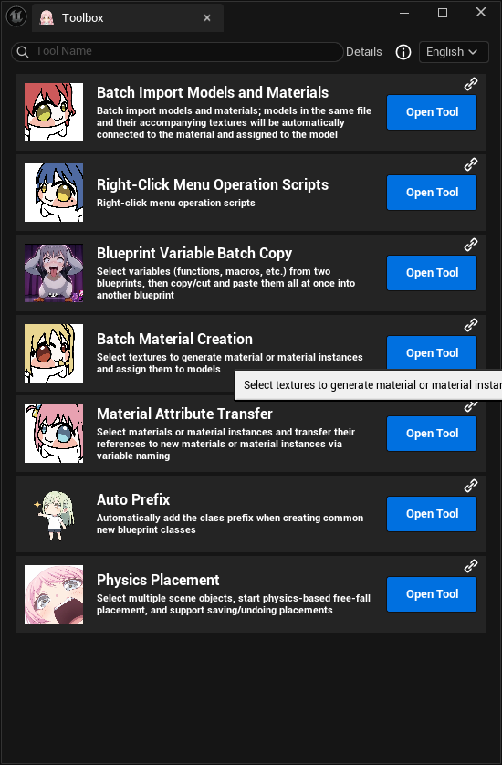
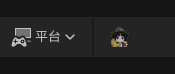
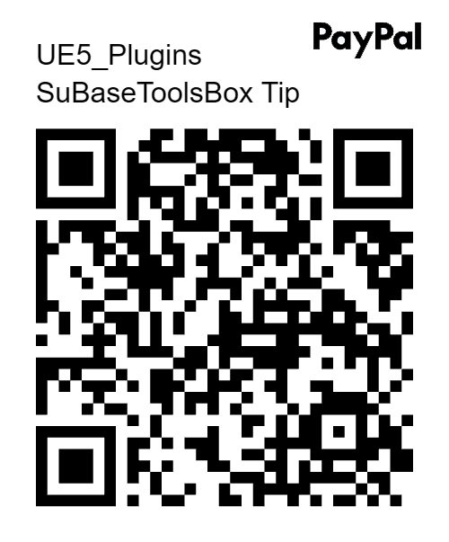

<div align="center">
  <!-- Replace with your plugin Logo: put the image under ReadmeImage/ and change the path -->
  

# SuBaseToolsBox

**An editor efficiency toolkit for Unreal Engine 5.8**

**English** · [简体中文](./README.md) · [日本語](./README.ja.md)

[](#system-requirements)
[](#localization)
[](#system-requirements)
[](#repository)

[Interface Preview](#interface-preview) · [Features](#features) · [Installation](#installation) · [Localization](#localization) · [Feedback](#feedback)

</div>

---

## Interface Preview

### Toolbox Overview (English)



## Features

ToolsBox adds a **"ToolsBox"** button to the level editor's toolbar. Click it to open the toolbox panel, which lists the following tools:

| Tool | Description |
|---|---|
| Batch Import Models and Materials | Models in the same folder and their accompanying textures are automatically connected to a material and assigned to the model |
| Right-Click Menu Operation Scripts | Scripted batch operations added to the asset / scene Actor right-click menus |
| Blueprint Variable Batch Copy | Select variables (functions, macros, etc.) from two blueprints, then copy / cut and paste them all at once into another blueprint |
| Batch Material Creation | Select textures to batch-generate materials or material instances and assign them to models |
| Material Attribute Transfer | Select materials / material instances and transfer references to new materials / material instances via variable naming |
| Auto Prefix | Automatically add the appropriate naming prefix when creating common new blueprint classes |
| Physics Placement | Select multiple scene objects, start physics-based free-fall placement, and support saving / undoing placements |

> New tools will keep being added. If you need something, leave a comment on Bilibili (or GitHub).

## Installation

### Option 1: As a project plugin

Copy the `ToolsBox` plugin folder from this repository into your project:

```
YourProject/Plugins/ToolsBox/
```

Then regenerate project files (right-click `.uproject` → Generate Visual Studio project files) and build.

### Option 2: As an engine plugin

Place it in the engine directory:

```
UE_5.8/Engine/Plugins/Marketplace/ToolsBox/
```

### Enable the plugin

After opening your project, search for `ToolsBox` under **Edit → Plugins**, check it to enable, then restart the editor.

## Usage

1. Enable the plugin and restart the editor;
2. A **"ToolsBox"** button appears on the level editor's top toolbar (near the Play button);

   

3. Click to open the toolbox panel; the tools are listed there, click a tool block to expand and use it.

## Localization

The plugin ships with three UIs: Simplified Chinese (native), English, and Japanese. Two ways to switch:

- **Default language**: edit the `"Language"` field in `ToolsBox/ToolsBox.uplugin` (`zh-Hans` / `en` / `ja`), save and restart the editor;
- **Runtime switching**: switch in real time via the language dropdown inside the toolbox.

## Buy the author a coffee

If this tool saved you some time, feel free to buy the author a coffee.

[](https://www.paypal.com/ncp/payment/99AXLB4W99D5A)

<div align="center">
  
  &nbsp;&nbsp;&nbsp;&nbsp;
  
  &nbsp;&nbsp;&nbsp;&nbsp;
  
  <br>
  <sub>WeChat / Alipay / PayPal</sub>
</div>

## Directory Structure

```
ToolsBox/
├─ ToolsBox.uplugin
├─ Source/ToolsBox/
│  ├─ Private/
│  │  ├─ ToolsBox.cpp                                # module entry, toolbar registration, language switch
│  │  ├─ Tools.cpp                                   # tool list Get_ToolsData()
│  │  ├─ Tools/                                       # per-tool implementations
│  │  │  ├─ IntelligentImportOfModelsAndMaterials/    # batch import models and materials
│  │  │  ├─ Right-ClickOperationTool/                 # right-click menu operation scripts
│  │  │  ├─ VariableCopier/                           # blueprint variable batch copy
│  │  │  ├─ SpawnMaterial/                            # batch material creation
│  │  │  ├─ MaterialAttributeTransfer/                # material attribute transfer
│  │  │  ├─ AutoPrefix/                               # auto prefix
│  │  │  ├─ PhysicsPlacer/                            # physics placement
│  │  │  └─ BlankTemplateTool/                        # blank template (reserved)
│  │  └─ Slate_Assist/                                # Slate helpers (icons, tool-block builder, localization)
│  └─ Public/Tools/...                                # corresponding headers
├─ Content/AssetActionUtility/                        # assets used by right-click tools
├─ Content/Localization/ToolsBox/{en,ja}              # translation PO files
├─ Resources/                                         # icon / image resources
└─ (generated at runtime) ToolUserDataSave/            # user-saved JSON configs
```

## Notes

- User-saved JSON configs are generated at runtime under the plugin's `ToolUserDataSave/` directory (ignored by `.gitignore`);
- The plugin is still in Beta (`IsBetaVersion = true` in the uplugin); APIs and features may change between versions;
- Tools only write to blueprints or assets when you explicitly click "OK / Apply"; physics placement, material attribute transfer, etc. modify scenes / assets, so back up your project beforehand;
- Right-click scripted operations batch-process assets by your selection; verify on a small scale before large-scale use;
- The plugin only works in the editor and does not affect packaged projects.

## Feedback

For issues like "function abnormal", "UI misaligned", "a tool unavailable under certain assets", please report in the following format for quick locating:

1. Open the "About" page inside the toolbox and note the plugin and engine versions;
2. Organize reproduction steps and related asset types;
3. Attach screenshots or logs;
4. Submit via [GitHub Issues](#repository).

GitHub Issues address:

```
https://github.com/SuBase/UE5-SuBaseToolsBox/issues
```

Feedback template:

```text
Unreal Engine version:
ToolsBox version:
Operating system:
Problem tool / module:
Steps to reproduce:
Actual result:
Expected result:
Can it be reproduced stably:
Screenshots / logs:
```

## License and Open Source

ToolsBox is **fully open-source and free to use**, and contributions and extensions of any kind are welcome:

- You can extend your own right-click operations by inheriting the `ActorAction` / `AssetAction` base classes, without modifying the tool's core;
- Pull Requests, Issues, and feature suggestions are also welcome to help make the tool better.

> [!IMPORTANT]
> **This tool may not be used for profit without the author's explicit permission.** Even a version you extended or modified yourself **may not be resold, repackaged for resale, or used for traffic-monetization**. Personal learning, in-project use, and open-source collaboration are not restricted, but any commercial / profit-making use requires the author's permission first.

GitHub repository homepage: <https://github.com/SuBase/UE5-SuBaseToolsBox>

## Repository

- Releases: <https://github.com/SuBase/UE5-SuBaseToolsBox/releases>
- Issues: <https://github.com/SuBase/UE5-SuBaseToolsBox/issues>

---


