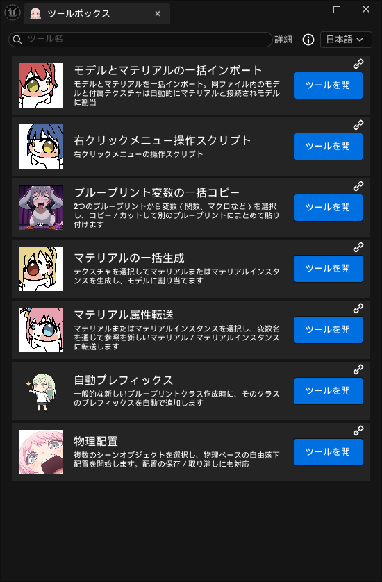

<div align="center">
  <!-- プラグインの Logo に置き換え：画像を ReadmeImage/ に入れてパスを変更 -->
  

# SuBaseToolsBox

**Unreal Engine 5.8 向けのエディタ用効率ツールセット**

**日本語** · [简体中文](./README.md) · [English](./README.en.md)

[](#システム要件)
[](#多言語対応)
[](#システム要件)
[](#リポジトリ)

[インターフェースプレビュー](#インターフェースプレビュー) · [機能一覧](#機能一覧) · [インストール](#インストール) · [多言語対応](#多言語対応) · [フィードバック](#フィードバック)

</div>

---

## インターフェースプレビュー

### ツールボックス総覧（日本語）



## 機能一覧

ToolsBox はレベルエディタのツールバーに **「ToolsBox」** ボタンを追加します。クリックするとツールボックスパネルが開き、以下のツールが表示されます。

| ツール | 説明 |
|---|---|
| モデルとマテリアルの一括インポート | 同じフォルダ内のモデルと付随するテクスチャは自動的にマテリアルに接続され、モデルに割り当てられます |
| 右クリックメニュー操作スクリプト | アセット／シーンアクタの右クリックメニューに追加されるスクリプト化された一括操作 |
| ブループリント変数の一括コピー | 2 つのブループリントから変数（関数、マクロなど）を選択し、コピー／カットして別のブループリントにまとめて貼り付けます |
| マテリアルの一括生成 | テクスチャを選択してマテリアルまたはマテリアルインスタンスを一括生成し、モデルに割り当てます |
| マテリアル属性転送 | マテリアル／マテリアルインスタンスを選択し、変数名を通じて新しいマテリアル／マテリアルインスタンスへ参照を転送します |
| 自動プレフィックス | 一般的な新しいブループリントクラスを作成する際、そのクラスに対応する命名プレフィックスを自動で追加します |
| 物理配置 | 複数のシーンオブジェクトを選択し、物理ベースの自由落下配置を開始します。配置の保存／取り消しにも対応します |

> 今後も新しいツールを継続的に追加していきます。ご要望があれば Bilibili のコメント欄（または GitHub）までお寄せください。

## インストール

### 方法 1：プロジェクトプラグインとして

このリポジトリの `ToolsBox` プラグインフォルダをプロジェクトにコピーします。

```
YourProject/Plugins/ToolsBox/
```

その後、プロジェクトファイルを再生成（`.uproject` を右クリック → Generate Visual Studio project files）してビルドします。

### 方法 2：エンジンプラグインとして

エンジンディレクトリに配置します。

```
UE_5.8/Engine/Plugins/Marketplace/ToolsBox/
```

### プラグインを有効化

プロジェクトを開いた後、**編集 → プラグイン** で `ToolsBox` を検索して有効化し、エディタを再起動します。

## 使い方

1. プラグインを有効化してエディタを再起動します；
2. レベルエディタの上部ツールバー（Play ボタンの近く）に **「ToolsBox」** ボタンが表示されます；

   

3. ボタンをクリックするとツールボックスパネルが開きます。ツールが一覧表示されるので、該当するツールブロックをクリックして展開・使用します。

## 多言語対応

プラグインには中国語（zh-Hans、ネイティブ）、英語、日本語の 3 つの UI が同梱されています。切り替え方法は 2 通り：

- **デフォルト言語**：`ToolsBox/ToolsBox.uplugin` の `"Language"` フィールドを `zh-Hans` / `en` / `ja` に編集し、保存してエディタを再起動する；
- **実行時切り替え**：ツールボックス内の言語ドロップダウンからリアルタイムに切り替える。

## 作者にコーヒーをおごる

このツールで時間を節約できたら、作者にコーヒーをおごってみてください。

[](https://www.paypal.com/ncp/payment/99AXLB4W99D5A)

<div align="center">
  
  &nbsp;&nbsp;&nbsp;&nbsp;
  
  &nbsp;&nbsp;&nbsp;&nbsp;
  
  <br>
  <sub>WeChat / Alipay / PayPal</sub>
</div>

## ディレクトリ構成

```
ToolsBox/
├─ ToolsBox.uplugin
├─ Source/ToolsBox/
│  ├─ Private/
│  │  ├─ ToolsBox.cpp                                # モジュール入口、ツールバー登録、言語切替
│  │  ├─ Tools.cpp                                   # ツール一覧 Get_ToolsData()
│  │  ├─ Tools/                                       # 各ツールの実装
│  │  │  ├─ IntelligentImportOfModelsAndMaterials/    # モデルとマテリアルの一括インポート
│  │  │  ├─ Right-ClickOperationTool/                 # 右クリックメニュー操作スクリプト
│  │  │  ├─ VariableCopier/                           # ブループリント変数の一括コピー
│  │  │  ├─ SpawnMaterial/                            # マテリアルの一括生成
│  │  │  ├─ MaterialAttributeTransfer/                # マテリアル属性転送
│  │  │  ├─ AutoPrefix/                               # 自動プレフィックス
│  │  │  ├─ PhysicsPlacer/                            # 物理配置
│  │  │  └─ BlankTemplateTool/                        # 空白テンプレート（予約）
│  │  └─ Slate_Assist/                                # Slate 補助（アイコン、ツールブロック生成、ローカライズ）
│  └─ Public/Tools/...                                # 対応するヘッダ
├─ Content/AssetActionUtility/                        # 右クリックツールが使用するアセット
├─ Content/Localization/ToolsBox/{en,ja}              # 翻訳 PO ファイル
├─ Resources/                                         # アイコン／画像リソース
└─ (実行時に生成) ToolUserDataSave/                    # ユーザー保存済み JSON 設定
```

## 注意事項

- ユーザーが保存した JSON 設定は実行時にプラグインの `ToolUserDataSave/` ディレクトリに生成されます（`.gitignore` で除外されています）；
- 本プラグインはまだベータ段階です（uplugin の `IsBetaVersion = true`）。API や機能はバージョン間で変更される可能性があります；
- ツールは「OK／適用」を明示的にクリックした場合にのみブループリントやアセットに書き込みます；物理配置、マテリアル属性転送などはシーン／アセットを変更するため、事前にプロジェクトのバックアップを取ることをお勧めします；
- 右クリックスクリプト操作は選択内容に基づいてアセットを一括処理するため、まずは小規模な範囲で検証してから大規模に使用してください；
- プラグインはエディタ内でのみ動作し、パッケージ済みのプロジェクトには影響しません。

## フィードバック

「機能異常」「UI のずれ」「特定のアセットでツールが使えない」などの問題が発生した場合は、迅速な切り分けのため以下のフォーマットでご報告ください：

1. ツールボックス内の「About」ページを開き、プラグインとエンジンのバージョンを控えます；
2. 再現手順と関連するアセットの種類を整理します；
3. スクリーンショットやログを添付します；
4. [GitHub Issues](#リポジトリ) から送信します。

GitHub Issues アドレス：

```
https://github.com/SuBase/UE5-SuBaseToolsBox/issues
```

フィードバックテンプレート：

```text
Unreal Engine バージョン：
ToolsBox バージョン：
OS：
問題のツール／モジュール：
再現手順：
実際の結果：
期待される結果：
安定して再現するか：
スクリーンショット／ログ：
```

## ライセンスとオープンソース

ToolsBox は **完全にオープンソースかつ無料** で、あらゆる形での貢献と拡張を歓迎します：

- `ActorAction` / `AssetAction` 基底クラスを継承することで、ツール本体を変更せずに自分専用の右クリック操作を拡張できます；
- Pull Request、Issue、機能提案も歓迎し、ツールの改善にご協力いただけます。

> [!IMPORTANT]
> **作者の明示的な許可なく、本ツールを営利目的で使用することはできません。** 自分で拡張・修正したバージョンであっても、**転売、再パッケージ販売、または集客・ monetization 目的での使用は禁止** です。個人の学習、プロジェクト内での利用、オープンソースでの協力はこの制限に含まれませんが、商用・営利目的の利用は事前に作者の許可を得てください。

GitHub リポジトリホーム：<https://github.com/SuBase/UE5-SuBaseToolsBox>

## リポジトリ

- Releases：<https://github.com/SuBase/UE5-SuBaseToolsBox/releases>
- Issues：<https://github.com/SuBase/UE5-SuBaseToolsBox/issues>

---


