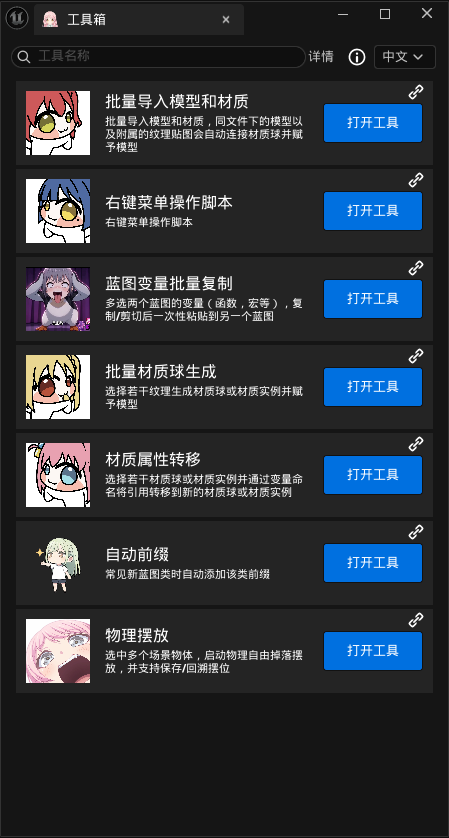

<div align="center">
  <!-- 替换为你的插件 Logo：把图片放到 ReadmeImage/ 下并改路径 -->
  

# SuBaseToolsBox

**面向 Unreal Engine 5.8 的编辑器效率工具集**

**简体中文** · [English](./README.en.md) · [日本語](./README.ja.md)

[](#系统要求)
[](#多语言与本地化)
[](#系统要求)
[](#仓库)

[界面预览](#界面预览) · [功能一览](#功能一览) · [安装方式](#安装方式) · [多语言与本地化](#多语言与本地化) · [问题反馈](#问题反馈)

</div>

---

## 界面预览

### 工具箱总览（简体中文）




## 功能一览

ToolsBox 在关卡编辑器的工具栏上添加一个 **「ToolsBox」** 按钮，点击即可打开工具箱面板，面板中列出以下工具：

| 工具 | 作用 |
|---|---|
| 批量导入模型和材质 | 同目录下的模型与附属纹理贴图自动连接材质球并赋予模型 |
| 右键菜单操作脚本 | 在资产 / 场景 Actor 右键菜单中提供脚本化批量操作 |
| 蓝图变量批量复制 | 多选两个蓝图的变量（函数、宏等），复制 / 剪切后一次性粘贴到另一个蓝图 |
| 批量材质球生成 | 选择若干纹理，生成材质球或材质实例并赋予模型 |
| 材质属性转移 | 选择若干材质球 / 材质实例，通过变量命名把引用转移到新的材质球 / 材质实例 |
| 自动前缀 | 新建常见蓝图类时自动添加该类对应的命名前缀 |
| 物理摆放 | 选中多个场景物体，启动物理自由掉落摆放，并支持保存 / 回溯摆位 |

> 后续会持续更新新工具，如有需要可到b站评论区留言（或github）

## 安装方式

### 方式一：作为项目插件

把本仓库里的 `ToolsBox` 插件文件夹复制到你的项目里：

```
YourProject/Plugins/ToolsBox/
```

然后重新生成项目文件（右键 `.uproject` → Generate Visual Studio project files）并构建。

### 方式二：作为引擎插件

放到引擎目录下：

```
UE_5.8/Engine/Plugins/Marketplace/ToolsBox/
```

### 启用插件

打开项目后，在 **编辑 → 插件** 中搜索 `ToolsBox`，勾选启用并重启编辑器。

## 使用方式

1. 启用插件并重启编辑器；

2. 关卡编辑器顶部工具栏（Play 按钮附近）会出现 **「ToolsBox」** 按钮；

   

3. 点击打开工具箱面板，上面列出各工具，点击对应工具块即可展开使用。

## 多语言与本地化

插件内置三语界面：简体中文（原生）、English、日本語。切换方式有两种：

- **默认语言**：修改 `ToolsBox/ToolsBox.uplugin` 的 `"Language"` 字段（`zh-Hans` / `en` / `ja`），保存后重启编辑器；
- **运行时切换**：在工具箱内的语言下拉菜单中实时切换。

## 请作者喝杯咖啡

如果这个工具帮你省下了时间，欢迎请作者喝杯咖啡。

[](https://www.paypal.com/ncp/payment/99AXLB4W99D5A)

<div align="center">
  
  &nbsp;&nbsp;&nbsp;&nbsp;
  
  &nbsp;&nbsp;&nbsp;&nbsp;
  
  <br>
  <sub>微信 / 支付宝 / PayPal</sub>
</div>

## 目录结构

```
ToolsBox/
├─ ToolsBox.uplugin
├─ Source/ToolsBox/
│  ├─ Private/
│  │  ├─ ToolsBox.cpp                                # 模块入口、工具栏注册、语言切换
│  │  ├─ Tools.cpp                                   # 工具列表 Get_ToolsData()
│  │  ├─ Tools/                                       # 各工具实现
│  │  │  ├─ IntelligentImportOfModelsAndMaterials/    # 批量导入模型和材质
│  │  │  ├─ Right-ClickOperationTool/                 # 右键菜单操作脚本
│  │  │  ├─ VariableCopier/                           # 蓝图变量批量复制
│  │  │  ├─ SpawnMaterial/                            # 批量材质球生成
│  │  │  ├─ MaterialAttributeTransfer/                # 材质属性转移
│  │  │  ├─ AutoPrefix/                               # 自动前缀
│  │  │  ├─ PhysicsPlacer/                            # 物理摆放
│  │  │  └─ BlankTemplateTool/                        # 空白模版（预留）
│  │  └─ Slate_Assist/                                # Slate 辅助（图标、工具块构建、本地化）
│  └─ Public/Tools/...                                # 对应头文件
├─ Content/AssetActionUtility/                        # 右键工具所用资产
├─ Content/Localization/ToolsBox/{en,ja}              # 翻译 PO 文件
├─ Resources/                                         # 图标 / 图片资源
└─ (运行时生成) ToolUserDataSave/                      # 用户保存的 JSON 配置
```

## 注意事项

- 用户保存的 JSON 配置会在运行时生成于插件的 `ToolUserDataSave/` 目录（已被 `.gitignore` 忽略）；
- 插件仍处于 Beta 阶段（`uplugin` 中 `IsBetaVersion = true`），API 与功能可能在版本间变动；
- 工具只在你明确点击「确定 / 应用」时才写入蓝图或资产；物理摆放、材质属性转移等会改动场景 / 资产，操作前建议先备份项目；
- 右键脚本化操作会按你的选择批量处理资产，建议先在小范围内验证再大面积使用；
- 插件仅作用于编辑器，不影响已打包的项目。

## 问题反馈

遇到「功能异常」「界面错位」「某工具在特定资产下不可用」等问题时，建议按下面的格式反馈，便于快速定位：

1. 打开工具箱内的「关于」页面，记录插件与引擎版本；
2. 整理复现步骤与相关资产类型；
3. 附上截图或日志；
4. 通过 [GitHub Issues](#仓库) 提交。

GitHub Issues 地址：

```
https://github.com/SuBase/UE5-SuBaseToolsBox/issues
```

反馈模板：

```text
Unreal Engine 版本：
ToolsBox 版本：
操作系统：
问题工具 / 模块：
操作步骤：
实际结果：
期望结果：
是否可稳定复现：
截图 / 日志：
```

## 许可证与开源

ToolsBox **完全开源、免费使用**，欢迎任何形式的贡献与扩展：

- 你可以通过继承 `ActorAction` / `AssetAction` 基类，自行扩展属于自己的右键操作，无需改动工具主体；
- 也欢迎提交 Pull Request、Issue 或功能建议，帮助工具变得更完善。

> [!IMPORTANT]
> **未经作者明确授权，不得将本工具用于营利。** 即使是你基于本工具自行扩展、修改后的版本，也**不可倒卖、重新打包转售或用于引流获利**。个人学习、项目内使用与开源协作均不受此限，但任何商业盈利行为请先取得作者许可。

GitHub 仓库主页：<https://github.com/SuBase/UE5-SuBaseToolsBox>

## 仓库

- Releases：<https://github.com/SuBase/UE5-SuBaseToolsBox/releases>
- Issues：<https://github.com/SuBase/UE5-SuBaseToolsBox/issues>

---


